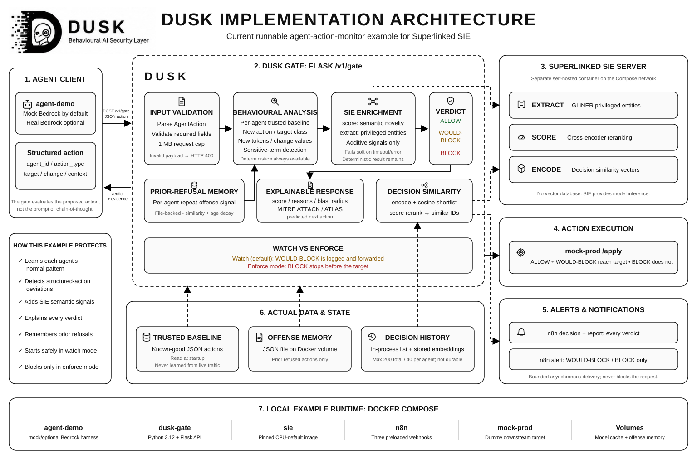

# DUSK agent-action-monitor

Watching agent behaviour for what most tooling quietly misses, with
Superlinked surfacing the anomalies.

> This is a self-contained example from the
> [DUSK](https://github.com/TFT444/DUSK) project. It has its own package,
> tests, sample data, and Docker Compose stack. See "What's in the box" for
> exactly what's bundled.



## What this shows

An AI agent proposes a control-plane action -- a firewall rule, a route
change, a role grant. DUSK's gate judges that **proposed action** itself,
not the prompt that led to it, against a per-agent behavioural baseline
built from the agent's own history. A hijacked agent still has valid
credentials, so anything that only checks "is this agent allowed to do
this" waves it through. Only *"does this agent normally do this"* catches
it -- and that's the question a credential check can't answer.

Two scenarios, both keyless by default:

- **Clean**: an agent proposes a routine action it makes every day. The
  gate allows it, and it reaches the downstream target.
- **Poisoned**: the agent's response is hijacked (a smuggled instruction in
  its context) into proposing an action well outside its own baseline --
  opening a firewall rule to `0.0.0.0/0` in a restricted segment. The gate
  flags it as anomalous immediately; in enforce mode it refuses the action
  before it ever reaches the downstream target (watch mode logs the same
  flag but lets it through -- see "What you'll see" below). The agent's
  credentials were real the whole time; only its behaviour gave the hijack
  away.

## Run it locally

```bash
docker compose up
```

Brings up the gate service (`dusk-gate`, the real `/v1/gate` HTTP
endpoint), a self-hosted SIE container (`sie`), `n8n`, a dummy downstream
target (`mock-prod`), and the agent harness (`agent-demo`) -- all on one
internal network, no external egress beyond `sie`'s one-time model-weight
download, no API keys required.

The first `up` cold-starts up to three CPU models in `sie` (encode, score,
extract) on demand, not necessarily all at once -- each gate request only
provisions the primitives it actually calls. Every SIE call is bounded to a
short provisioning timeout (1.5s): a cold or at-capacity model falls back
to the deterministic path in about a second rather than blocking the gate,
so a slow or memory-constrained first `sie` startup degrades individual
request latency, it doesn't hang them. Allocate at least 8 GB to Docker
Desktop for `sie` to load its models promptly in the background; under
that, model loading itself takes longer (competing for memory), but
`/v1/gate` keeps responding throughout.

Without Docker, run the pieces directly. The base install (`pip install -e .`)
works on Python 3.11+; the `sie` extra (real SIE encode/score/extract, rather
than the deterministic n-gram fallback) requires **Python 3.12+**, since
`sie-sdk` itself does -- see the Dockerfile, which uses `python:3.12-slim` for
exactly this reason:

```bash
# optional: start from the documented SIE settings
cp .env.example .env

# terminal 1: the gate
python -m dusk.api

# terminal 2: the dummy downstream target
python mock-prod/app.py

# terminal 3: the scenarios
python agent-demo/run_scenario.py
```

### What you'll see

By default the gate runs in **watch mode** (`DUSK_ENFORCE=false`), which is
observational: a poisoned action gets `WOULD-BLOCK` and the reason is
logged, but the action still proceeds -- an inline gate that wrongly blocks
a legitimate action can disrupt a network, so DUSK doesn't enforce until an
operator has built confidence in the baseline.

```
=== clean ===
verdict:  ALLOW
applied:  True
action:   { "agent_id": "netops-agent", "action_type": "route_change", "target": "rt-corp-prod", ... }

=== poisoned ===
verdict:  WOULD-BLOCK
applied:  True
reasons:  target introduces unseen terms ['restricted', 'segment'], change introduces unseen values ['0.0.0.0/0', 'allow'], newly introduces sensitive or privileged terms ['0.0.0.0/0', 'restricted']
action:   { "agent_id": "netops-agent", "action_type": "firewall_rule_change", "target": "fw-corp-restricted-segment", ... }
```

Check the downstream target's log directly (`curl http://localhost:9000/log`)
-- both actions are there in watch mode. The flagged reasons on the
poisoned one are the signal: an operator watching this log sees exactly
what an inline gate would have stopped, before ever trusting it to do so
automatically.

Set `DUSK_ENFORCE=true` on the `dusk-gate` service to switch to **enforce
mode**, where `BLOCK` actually stops the action before it reaches
`mock-prod`:

```
=== poisoned (enforce mode) ===
verdict:  BLOCK
applied:  False
reasons:  target introduces unseen terms ['restricted', 'segment'], change introduces unseen values ['0.0.0.0/0', 'allow'], newly introduces sensitive or privileged terms ['0.0.0.0/0', 'restricted']
```

Now `mock-prod`'s log shows only the clean action -- that absence is the
entire point of enforce mode, once watch mode has built enough confidence
to turn it on.

### n8n webhooks

Every verdict fires `decision` and `report`; refused verdicts also fire
`alert` (`src/dusk/trace/n8n_client.py`). The `n8n` container has these
three webhooks active from startup (`n8n/dusk-webhooks.json`, baked into
the image, not imported by hand) -- each just responds immediately, no
external service involved. Watch them land in the executions list at
`http://localhost:5678`.

## Sample data

`sample-data/baseline.json` (15 known-good actions across three agents,
already mounted into `dusk-gate` at `DUSK_GATE_BASELINE_PATH`) and
`sample-data/check-mixed.json` (that same baseline plus 3 out-of-pattern
actions) let you exercise the gate directly with `docker compose up`
running, independent of the agent harness:

```bash
python -c "
import json, urllib.request
for action in json.load(open('sample-data/check-mixed.json')):
    req = urllib.request.Request(
        'http://localhost:8000/v1/gate',
        data=json.dumps(action).encode(),
        headers={'Content-Type': 'application/json'},
    )
    verdict = json.load(urllib.request.urlopen(req))
    print(action['target'], '->', verdict['verdict'])
"
```

This is the same fixture data used in DUSK's own test suite (a labelled
precision/recall benchmark asserts the gate catches every one of the 3
attacks with zero false alarms on the 15 routine actions).

## Model lineup

| Stage | Model | Size | Role |
|---|---|---|---|
| Encode | `BAAI/bge-m3` | ~568M params, MIT | Embeds each verdict once, when it's recorded, and embeds each new action once, when it's checked -- similarity between the two powers `similar_decision_ids`. |
| Score | `BAAI/bge-reranker-v2-m3` | ~568M params, Apache-2.0 | Reranks the encode-shortlisted history for `similar_decision_ids`, and separately reranks an agent's own baseline history to catch semantic novelty. |
| Extract | `urchade/gliner_multi-v2.1` | ~289M params, Apache-2.0 | Zero-shot NER for privileged terms (role, privilege, resource, segment, port), weighted by the model's own confidence rather than a flat yes/no. |

All three ship in the `default` bundle of the pinned
`sie-server:v0.4.1-cpu-default` image. The example intentionally pairs that
server with `sie-sdk==0.6.17`, the combination used for its recorded live
validation. The pin makes the demo reproducible; update the pair only after
running the live benchmark against the replacement versions. Each model is a
`Config` field (`sie_encode_model` / `sie_score_model` /
`sie_extract_model`) and can be replaced through the matching
`DUSK_SIE_*_MODEL` environment variable when it exists in the target SIE
catalog.

## SIE features used

All three primitives run on the live `/v1/gate` request path, not just in
a benchmark, and every signal they feed is additive-only, so disabling SIE
degrades detection quality rather than breaking anything.

`/v1/gate`'s response carries the result directly: `similar_decision_ids`
is populated from a real per-agent decision history (embedded once at
record time, capped at 200 entries so lookup cost stays O(1) regardless of
how long the gate has been running -- see `src/dusk/api.py`), not
hardcoded. This has also been validated against Superlinked's hosted SIE
cluster directly, not just assumed: `sie_encode` returns a genuine
1024-dimension `bge-m3` vector, precision/recall on the labelled fixture is
unchanged with SIE live versus the deterministic-only baseline (1.0/1.0
either way), and at least one attack's reasons carry a real SIE-sourced
marker confirming the primitives are actually contributing a signal over
the network. See `docs/sie-primitives.md` for exactly where each primitive
is wired in.

## Why SIE specifically

The alternative to one SIE cluster serving all three primitives is three
separate vendors (an embeddings API, a reranking API, an NER API), three
sets of credentials, three failure modes. One self-hosted SIE container
covers encode, score, and extract behind one client, with no API key
needed for local development -- and the same client code points at a
hosted endpoint for real-load testing with a one-line env var change.

## Latency

The recorded full `agent-demo` -> gate -> `mock-prod` run used Superlinked's
hosted tester cluster, 20 requests per concurrency level, and a 20% poisoned /
80% clean mix:

| Concurrency | p50 | p95 | Errors |
|---|---|---|---|
| 1 | 294ms | 10008ms | 2/20 |
| 3 | 307ms | 474ms | 0/20 |
| 5 | 295ms | 317ms | 0/20 |

Every allowed action reached `mock-prod`, and every poisoned action was
flagged `WOULD-BLOCK`. See `docs/gate-latency-notes.md` for the methodology,
cold-start behavior, and limitations of this single small trial.

## What's in the box

This example is self-contained and includes everything needed to run the
complete local flow:

- `Dockerfile`, `compose.yml` -- the gate service, self-hosted SIE,
  n8n, mock-prod, and agent-demo, wired together on one internal network
- `contracts/gate.openapi.yaml` -- the frozen `/v1/gate` request/response
  contract
- `src/dusk/` -- the gate itself: `actions/` (baseline, analyse, verdict),
  `trace/` (SIE client, n8n webhooks), `config.py`, and `api.py`. This example
  deliberately contains only the agent-action gate; network packet detection
  is outside its scope
- `agent-demo/` -- the Bedrock-or-mock agent harness, tool-call extraction,
  load driver
- `mock-prod/` -- the dummy downstream target
- `n8n/` -- a custom n8n image with the three DUSK webhooks (decision/
  report/alert) baked in and active from container start; no manual
  workflow import, no external service in the workflow itself
- `sample-data/` -- the baseline and mixed-check fixtures referenced above

## Extend it

- **Swap the baseline.** Point `DUSK_GATE_BASELINE_PATH` at your own
  known-good action history instead of `sample-data/baseline.json`, or
  select a different adapter (`azure`, `bedrock`, `generic`) with
  `DUSK_GATE_BASELINE_SOURCE`. `gate_block_threshold` will need
  re-tuning on your own labelled traffic, not just the synthetic
  fixture bundled here.
- **Try different models.** All three model IDs are `Config` fields,
  overridable via `DUSK_SIE_*_MODEL` env vars (see "Model lineup" above)
  -- no code change, provided the replacement is in your SIE catalog.
- **Add a fourth signal.** The deterministic score and every SIE signal
  compose additively in `analyse.py` -- a velocity check, a
  device-fingerprint rule, or another `extract` pass over a different
  field can be layered in the same way `_repeat_offense_signal` was.
- **Make `similar_decision_ids` durable across replicas.** The per-agent
  decision history in `api.py` is capped and in-process; swapping it for
  a shared store keeps it consistent when the gate runs as more than one
  instance.
- **Route verdicts elsewhere.** The three n8n webhooks (decision/report/
  alert) are plain HTTP POSTs -- point them at Slack, PagerDuty, or a
  SIEM instead of, or alongside, n8n.

## Known limits

- `/v1/gate` is unauthenticated with CORS open to all origins, and compose
  publishes it on every host interface. That's appropriate for a local
  example anyone can curl immediately -- it is not a production security
  boundary. Put a real auth layer and network restriction in front of it
  before exposing it beyond a trusted internal network.
- If `DUSK_GATE_BASELINE_PATH` is set but the file fails to load, the gate
  still serves requests -- every agent just reads as unknown, which is a
  real degradation of what the gate actually catches, not just a startup
  error. `/health` reports `{"status": "degraded", "baseline_error": ...}`
  in this case; a real deployment should alert on that rather than only a
  log line.
- The baseline/attack fixtures are synthetic, not real production traffic.
- The deterministic feature checks in DUSK's gate do the primary anomaly
  scoring; SIE's three primitives are an enrichment layer on top of that,
  not a replacement for it -- the gate's core detection logic is not
  dependent on any AI model at runtime.
- SIE's rerank pass only reorders a small shortlist of candidates already
  retrieved by cosine similarity, not the full decision history.
- The extract model's privileged-term detection is zero-shot and has only
  been evaluated against the same synthetic fixtures used elsewhere, not an
  adversarial corpus designed to evade it specifically.
- Latency numbers are from a single 20-request-per-level trial against a
  shared tester cluster; enough to confirm the shape, not a high-confidence
  p95 at every level. See `docs/gate-latency-notes.md`.

## Built with

- [Superlinked SIE](https://github.com/superlinked/sie) (Apache-2.0): the
  inference engine hosting all three primitives
- [Flask](https://flask.palletsprojects.com/) and [n8n](https://n8n.io/):
  the `/v1/gate` HTTP service and the decision/report/alert webhook
  automation
- [BAAI/bge-m3](https://huggingface.co/BAAI/bge-m3) (MIT): encode
- [BAAI/bge-reranker-v2-m3](https://huggingface.co/BAAI/bge-reranker-v2-m3)
  (Apache-2.0): score
- [urchade/gliner_multi-v2.1](https://huggingface.co/urchade/gliner_multi-v2.1)
  (Apache-2.0): extract

## Credits

Built by Ritik Sah and Tanvir Farhad.
