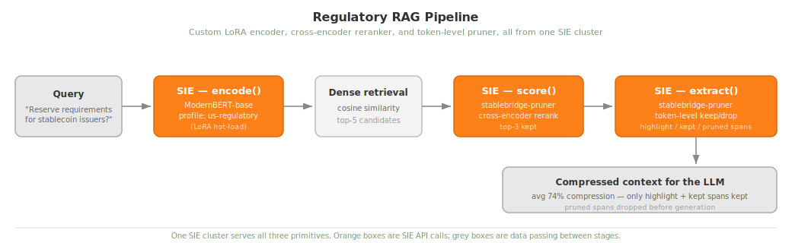

# Regulatory RAG: Custom Models on SIE

The "advanced hosting" example. Shows how to run a real production
RAG stack on SIE with **two things you won't find in a stock
sie-server**: a domain-adapted LoRA encoder and a custom cross-encoder
adapter that does reranking *and* token-level context pruning in one
forward pass. Everything needed to host the advanced stuff lives in
[`server-plugin/`](./server-plugin) as a thin Docker-baked extension.

## The pipeline



Detail per stage:

- **Encode** — `ModernBERT-base` with the `us-regulatory` profile, which hot-loads the `sugiv/modernbert-us-stablecoin-encoder` LoRA weights at request time. Produces a 768-dim domain-adapted embedding.
- **Dense retrieval** — in-memory cosine similarity over the corpus, top-5 kept.
- **Score / Rerank** — `sugiv/stablebridge-pruner-highlighter` cross-encoder, keeps top-3.
- **Extract / Prune** — same Stablebridge model, second primitive. Returns token-level keep/drop probabilities aggregated into `highlight` / `kept` / `pruned` spans.
- **LLM context** — the surviving `highlight` and `kept` spans become the compressed context passed downstream. Averages 74% compression vs. the raw reranked passages.

## Why this example exists

Most OSS inference servers assume you're running off-the-shelf models.
Real teams don't. They fine-tune encoders on their domain, they
train pruner heads to cut LLM context costs, they mix and match. This
example shows the full path (**extend the server, register new
models, hit them from the SDK**) using a regulatory-intelligence
use case built on public-good data.

Two model additions drive the pipeline:

| Model | Base | Task | What it adds |
|-------|------|------|--------------|
| [`sugiv/modernbert-us-stablecoin-encoder`](https://huggingface.co/sugiv/modernbert-us-stablecoin-encoder) | `answerdotai/ModernBERT-base` | encode | LoRA adapter (r=16, α=32, 8.77 MB) fine-tuned on US stablecoin regulations. Hot-loaded via the `us-regulatory` profile on the base model, no separate deployment. |
| [`sugiv/stablebridge-pruner-highlighter`](https://huggingface.co/sugiv/stablebridge-pruner-highlighter) | `BAAI/bge-reranker-v2-m3` | score, extract | `PruningHead` MLP (525K params) on top of the frozen reranker. Produces rerank scores *and* token-level keep/drop probabilities in one forward pass. |

## SIE features demonstrated

| Feature | How it's used here |
|---------|-------------------|
| **encode** | Domain-adapted dense embeddings (ModernBERT + LoRA) |
| **score** | Cross-encoder reranking of retrieved candidates |
| **extract** | Token-level pruning + sentence-level highlight spans |
| **profiles** | `us-regulatory` profile activates LoRA weights at request time |
| **custom adapter** | `StablebridgePrunerAdapter` extends `sie_server.adapters.ModelAdapter` to add pruning under the `extract` primitive |
| **cost-based batching** | SIE batches by token count, handling variable-length regulatory docs |
| **model sharing** | Encoder + pruner share one GPU via SIE's LRU memory management |

## Quick start

### 1. Build a custom sie-server image

Everything the pipeline needs on the server side is packaged in
[`server-plugin/`](./server-plugin): the patch, the adapter, the YAMLs.

```bash
# From this directory
docker build -t sie-regulatory --build-arg SIE_TAG=latest-cuda12-default ./server-plugin
docker run --gpus all -p 8080:8080 sie-regulatory
# CPU-only also works for the tiny sample corpus:
# docker build -t sie-regulatory --build-arg SIE_TAG=latest-cpu-default ./server-plugin
# docker run -p 8080:8080 sie-regulatory
```

See [`server-plugin/README.md`](./server-plugin/README.md) for what's
in the image and how to extend it further.

### 2. Run the pipeline

```bash
# No dependencies to install; the client uses stdlib urllib.
python rag_pipeline.py
```

Options:

```
--url URL      SIE server URL (default: http://localhost:8080)
--query TEXT   Custom query (default: runs all sample regulatory queries)
--top-k N      Candidates from dense retrieval (default: 5)
--output PATH  Save results as JSON
--quiet        Minimal output
```

## Benchmark Results (RTX PRO 6000 Blackwell, 98GB VRAM)

| Operation | Mean Latency | p95 Latency | Notes |
|-----------|-------------|-------------|-------|
| Encode (base)          | 20 ms | 25 ms | 768-dim dense embedding |
| Encode (LoRA)          | 23 ms | 27 ms | +3 ms for LoRA adapter switch |
| Score (2 candidates)   | 15 ms | 17 ms | Cross-encoder reranking |
| Score (10 candidates)  | 19 ms | 21 ms | Sub-linear scaling |
| Extract (single doc)   | 17 ms | 19 ms | Pruning + highlighting |
| **E2E Pipeline**       | **61 ms** | **66 ms** | Encode → Score(5) → Extract(1) |

100% correct ranking on relevant vs. irrelevant passages. Average
74% character-count compression on the final context vs. the raw
reranked passages. On smaller GPUs (A10G, L4) expect 3–4× these
numbers.

## Files

```
regulatory-rag/
├── rag_pipeline.py          # 3-stage RAG pipeline (stdlib only)
├── sample_corpus.json       # 12 US regulatory passages
├── README.md                # This file
└── server-plugin/
    ├── README.md            # What the plugin does, how to extend it
    ├── Dockerfile           # Builds sie-server with the extensions baked in
    ├── encode_lora_routing.patch
    ├── adapters/
    │   └── stablebridge_pruner/
    │       └── __init__.py  # Custom ModelAdapter, 659 lines
    └── models/
        ├── answerdotai__ModernBERT-base.yaml
        └── sugiv__stablebridge-pruner-highlighter.yaml
```

## Architecture notes

**LoRA as a profile.** SIE serves LoRA adapters by loading the base
model once and activating LoRA weights via named profiles. When the
pipeline calls `encode("answerdotai/ModernBERT-base", profile="us-regulatory")`,
SIE applies the `sugiv/modernbert-us-stablecoin-encoder` weights to
the shared base, with no separate deployment or rebuild. Swap in another
LoRA by adding another profile block to the model YAML.

**The pruner as an adapter.** `StablebridgePrunerAdapter` wraps a
frozen `BAAI/bge-reranker-v2-m3` with a trained `PruningHead` MLP
(1024 → 512 → 1). It exposes both `score()` and `extract()` from the
same forward pass. The classifier output becomes the rerank score,
the per-token hidden states become keep/drop probabilities. That's a
new kind of primitive that wouldn't exist in a stock embedding server.

**Entities are just SIE entities.** The pruner returns semantic labels
you can filter on downstream:

- **`highlight`** (score ≥ 0.9): directly answers the query
- **`kept`** (score ≥ 0.6): supporting context worth preserving
- **`pruned`** (score < 0.6): can be safely removed
- **`summary`**: compression statistics

## Credits

Built by [@sugix](https://github.com/sugix) as part of the SIE alpha
tester program. LoRA training used `answerdotai/ModernBERT-base` on a
curated corpus of US stablecoin regulation; pruner head trained on
BEIR-style relevance judgments.

## License

Apache 2.0, same as SIE.
