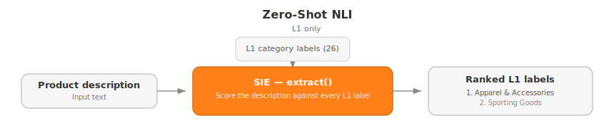
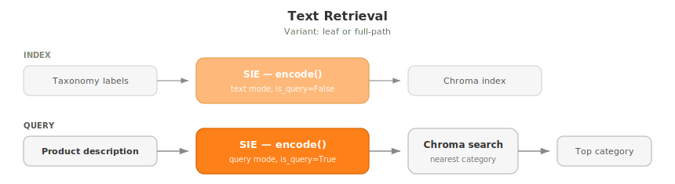
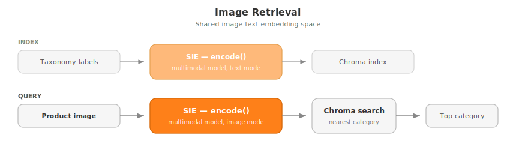
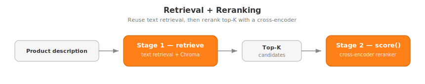

# Build a multi-modal product classifier with embeddings

Classify products into a large hierarchical taxonomy using SIE as the unified inference layer.

## Problem

Taxonomy classification assigns a category path (e.g. `Electronics > Computers > Laptops`) to a product given its description or image. Real-world taxonomies are large (10K+ categories), hierarchical (up to 8 levels deep), and ambiguous (multiple categories can be valid for the same product).

Google's [Custom Taxonomy Classifier](https://github.com/google-marketing-solutions/custom-taxonomy-classifier) demonstrates a minimal version of this: embed flat category names with a single Vertex AI model, retrieve the nearest neighbor. This project goes further: we systematically evaluate multiple approaches across text, vision, with and without reranking on a hierarchical taxonomy.

## Why SIE

Taxonomy classification is not a single-model problem. Finding the best approach requires experimenting with fundamentally different model types:

| SIE capability | Model type | Role |
|---------------|-----------|------|
| `extract` | NLI / zero-shot classifiers | Score query-category entailment |
| `encode` | Text embedding models | Embed products and categories for retrieval |
| `encode` | Vision models (CLIP, SigLIP) | Embed product images for retrieval |
| `score` | Cross-encoder rerankers | Rerank retrieval candidates |

SIE serves all of these behind a single API. Switching from text embeddings to NLI to image retrieval to cross-encoder reranking requires one code line change, not rebuilding infrastructure. This makes it practical to run a structured evaluation across approaches that would otherwise each need their own serving stack.

## SIE setup

All scripts in this example talk to a running SIE server. See the [SIE quickstart](https://superlinked.com/docs/quickstart) for how to run it locally or point at a cluster.

Once SIE is reachable, create a `.env` in this directory with the URL of your SIE server or cluster:

```bash
cp .env.example .env
# then edit SIE_BASE_URL (default: http://localhost:8080)
```

## Dataset and metrics

We use [Shopify/product-catalogue](https://huggingface.co/datasets/Shopify/product-catalogue), based on the [Shopify Product Taxonomy](https://github.com/Shopify/product-taxonomy). Each row gives us a product title, product description, product image, one ground-truth category path, and `potential_product_categories` for plausible alternatives.

For this example we keep the working set intentionally small: only the first train shard, which becomes 2,309 products after cleaning and trimming. The goal here is not to build the best possible classifier, but to show how SIE makes it easy to iterate quickly across very different ML approaches.

To prepare the exact dataset used in this project:

```bash
uv sync
uv run download-shopify-dataset
uv run download-shopify-taxonomy
uv run clean-shopify-dataset
uv run trim-shopify-dataset-to-l3
```

These scripts generate the following files under `data/`:
- `train-00000-of-00015.parquet`: the raw Shopify train shard downloaded from Hugging Face
- `shopify-taxonomy-categories.txt`: the raw taxonomy categories file from Shopify
- `shopify-products-clean-full-depth.parquet`: cleaned dataset with required fields and valid taxonomy labels
- `shopify-taxonomy-l3.parquet`: taxonomy trimmed to 3 levels
- `shopify-products-experiment-l3.parquet`: final L3 dataset used by the evaluation scripts

To keep evaluation simple, we trim the taxonomy to 3 levels:
- `26` L1 labels
- `213` L2 nodes
- `1,790` total nodes

We report hierarchical F1 (`hF1`) in two settings:
- **strict**: only the single `ground_truth_category` counts as correct
- **lenient**: any label in `potential_product_categories` counts as correct

## Approaches

### Zero-Shot NLI

This approach scores only the top-level Shopify category from `product_description` via `sie.extract()`. This is the simplest baseline: no index, no retrieval step, just direct scoring against all 26 L1 labels.



The actual eval uses all 26 Shopify L1 labels; the shorter example below uses three for readability:

```python
result = client.extract(
    "knowledgator/gliclass-large-v3.0",
    Item(text="Handwoven straw Panama hat with a cotton ribbon."),
    labels=[
        "Apparel & Accessories",
        "Home & Garden",
        "Sporting Goods",
    ],
)

for classification in result["classifications"]:
    print(f"{classification['label']}: {classification['score']:.2f}")
# Apparel & Accessories: 1.00
```

CLI scripts for running full evaluation and one-off predictions:

```bash
# eval
uv run eval-nli \
  --model knowledgator/gliclass-large-v3.0 \
  --output eval/nli/knowledgator-gliclass-large-v3.0.json

# predict
uv run predict-nli \
  --model knowledgator/gliclass-large-v3.0 \
  --description "Handwoven straw Panama hat with a cotton ribbon." \
  --top-k 5
```

We evaluated two NLI models:

- `knowledgator/gliclass-large-v3.0` (`0.5B`)
- `cross-encoder/nli-deberta-v3-base` (`200M`)

Since this approach predicts only L1, we report L1 macro F1 rather than hierarchical F1:

| Approach | Model | Model size | L1 F1 (strict) | L1 F1 (lenient) |
|---|---|---:|---:|---:|
| nli | `knowledgator/gliclass-large-v3.0` | `0.5B` | `0.302` | `0.384` |
| nli | `cross-encoder/nli-deberta-v3-base` | `200M` | `0.204` | `0.285` |

This gives us a clean top-level baseline, but it is not a good fit for the full hierarchy. The label space grows from 26 L1 labels to 213 L2 nodes and 1,790 total nodes in the trimmed L3 taxonomy, so the next approaches switch to retrieval-based models more suitable for larger candidate sets.

### Text Retrieval

This is the first approach that works on the full hierarchy. We encode each `product_description` as a query vector, encode each taxonomy path as a category vector, store the category embeddings in Chroma, and return the nearest path. `full-path` uses strings like `Apparel & Accessories > Clothing Accessories > Hats`; `leaf` uses only the last node, like `Hats`.



The raw `encode()` calls look like this. Here we compare one product against three candidate paths by hand; in the full pipeline, all category vectors live in Chroma.

```python
query = client.encode(
    "NovaSearch/stella_en_1.5B_v5",
    Item(text="Handwoven straw Panama hat with a cotton ribbon."),
    is_query=True,
)

categories = client.encode(
    "NovaSearch/stella_en_1.5B_v5",
    [
        Item(text="Apparel & Accessories > Clothing Accessories > Hats"),
        Item(text="Home & Garden > Decor > Coat & Hat Racks"),
        Item(text="Sporting Goods > Outdoor Recreation > Camping & Hiking"),
    ],
    is_query=False,
)

# After cosine similarity on the returned vectors:
# Apparel & Accessories > Clothing Accessories > Hats: 0.46
# Home & Garden > Decor > Coat & Hat Racks: 0.34
# Sporting Goods > Outdoor Recreation > Camping & Hiking: 0.21
```

CLI scripts for running full evaluation and one-off predictions:

```bash
# eval
uv run eval-text-retrieval \
  --model NovaSearch/stella_en_1.5B_v5 \
  --variant full-path \
  --index-dir .cache/chroma \
  --output eval/text-retrieval/NovaSearch-stella_en_1.5B_v5-full-path.json

# predict
uv run predict-text-retrieval \
  --model NovaSearch/stella_en_1.5B_v5 \
  --variant full-path \
  --index-dir .cache/chroma \
  --description "Handwoven straw Panama hat with a cotton ribbon." \
  --top-k 5
```

We evaluated three text embedding models in both indexing variants:

| Approach | Model | Model size | hF1 (strict) | hF1 (lenient) | Variant |
|---|---|---:|---:|---:|---|
| text-retrieval | `NovaSearch/stella_en_1.5B_v5` | `1.5B` | `0.425` | `0.553` | `full-path` |
| text-retrieval | `NovaSearch/stella_en_1.5B_v5` | `1.5B` | `0.334` | `0.450` | `leaf` |
| text-retrieval | `intfloat/multilingual-e5-large` | `0.6B` | `0.301` | `0.356` | `full-path` |
| text-retrieval | `intfloat/multilingual-e5-large` | `0.6B` | `0.295` | `0.385` | `leaf` |
| text-retrieval | `sentence-transformers/all-MiniLM-L6-v2` | `23M` | `0.253` | `0.344` | `leaf` |
| text-retrieval | `sentence-transformers/all-MiniLM-L6-v2` | `23M` | `0.239` | `0.312` | `full-path` |

Text retrieval ends up being the strongest family in this project. `NovaSearch/stella_en_1.5B_v5` with `full-path` indexing is the best overall result (`0.425` strict, `0.553` lenient). `full-path` clearly helps Stella, while the tiny `all-MiniLM-L6-v2` does slightly better with `leaf` labels.

The dataset also includes product images, so the next step is to keep the same retrieval setup and swap the text query for an image query.

### Image Retrieval

Image retrieval keeps the same idea, but the query is now a product image instead of text. The category side is still text, so we need a multimodal model that maps images and taxonomy paths into the same vector space.



Here is the same hat example, this time starting from an image:

```python
query = client.encode(
    "laion/CLIP-ViT-H-14-laion2B-s32B-b79K",
    Item(
        images=[
            {
                "data": Path("assets/sample-images/03.jpg").read_bytes(),
                "format": "jpeg",
            }
        ]
    ),
)

categories = client.encode(
    "laion/CLIP-ViT-H-14-laion2B-s32B-b79K",
    [
        Item(text="Apparel & Accessories > Clothing Accessories > Hats"),
        Item(text="Home & Garden > Decor > Coat & Hat Racks"),
        Item(text="Sporting Goods > Outdoor Recreation > Camping & Hiking"),
    ],
    is_query=False,
)

# After cosine similarity on the returned vectors:
# Apparel & Accessories > Clothing Accessories > Hats: 0.25
# Home & Garden > Decor > Coat & Hat Racks: 0.12
# Sporting Goods > Outdoor Recreation > Camping & Hiking: 0.06
```

CLI scripts for running full evaluation and one-off predictions:

```bash
# eval
uv run eval-image-retrieval \
  --model laion/CLIP-ViT-H-14-laion2B-s32B-b79K \
  --variant full-path \
  --index-dir .cache/chroma \
  --output eval/image-retrieval/laion-CLIP-ViT-H-14-laion2B-s32B-b79K-full-path.json

# predict
uv run predict-image-retrieval \
  --model laion/CLIP-ViT-H-14-laion2B-s32B-b79K \
  --variant full-path \
  --index-dir .cache/chroma \
  --image-path assets/sample-images/03.jpg \
  --top-k 5
```

We evaluated two multimodal models in both indexing variants:

| Approach | Model | Model size | hF1 (strict) | hF1 (lenient) | Variant |
|---|---|---:|---:|---:|---|
| image-retrieval | `laion/CLIP-ViT-H-14-laion2B-s32B-b79K` | `1B` | `0.353` | `0.451` | `full-path` |
| image-retrieval | `laion/CLIP-ViT-H-14-laion2B-s32B-b79K` | `1B` | `0.325` | `0.420` | `leaf` |
| image-retrieval | `openai/clip-vit-base-patch32` | `150M` | `0.208` | `0.258` | `full-path` |
| image-retrieval | `openai/clip-vit-base-patch32` | `150M` | `0.189` | `0.245` | `leaf` |

The best image-only result comes from `laion/CLIP-ViT-H-14-laion2B-s32B-b79K` with `full-path` indexing (`0.353` strict, `0.451` lenient). That is clearly better than the smaller CLIP model, but still below the best text retriever, so text remains the strongest signal in these runs.

Since text retrieval is our best base method, the final question is whether a second-stage reranker can improve it.

### Retrieval + Reranking

Reranking starts with the best text retriever, keeps its top-5 candidates, and asks a cross-encoder to rescore them with `sie.score()`. The hope is that a more expensive second pass can fix mistakes from nearest-neighbor retrieval.



In the full pipeline, the candidates come from Stella full-path retrieval. The reranking call itself looks like this:

```python
result = client.score(
    "mixedbread-ai/mxbai-rerank-base-v2",
    Item(text="Handwoven straw Panama hat with a cotton ribbon."),
    [
        Item(
            id="Apparel & Accessories > Clothing Accessories > Hats",
            text="Apparel & Accessories > Clothing Accessories > Hats",
        ),
        Item(
            id="Home & Garden > Decor > Coat & Hat Racks",
            text="Home & Garden > Decor > Coat & Hat Racks",
        ),
        Item(
            id="Sporting Goods > Outdoor Recreation > Camping & Hiking",
            text="Sporting Goods > Outdoor Recreation > Camping & Hiking",
        ),
    ],
)

for score in result["scores"]:
    print(f"{score['item_id']}: {score['score']:.2f}")
# Apparel & Accessories > Clothing Accessories > Hats: 1.00
# Home & Garden > Decor > Coat & Hat Racks: 0.04
# Sporting Goods > Outdoor Recreation > Camping & Hiking: 0.02
```

CLI scripts for running full evaluation and one-off predictions:

```bash
# eval
uv run eval-reranking \
  --retrieval-model NovaSearch/stella_en_1.5B_v5 \
  --reranker-model mixedbread-ai/mxbai-rerank-base-v2 \
  --variant full-path \
  --index-dir .cache/chroma \
  --top-k 5 \
  --output eval/reranking/NovaSearch-stella_en_1.5B_v5-full-path-mixedbread-ai-mxbai-rerank-base-v2.json

# predict
uv run predict-reranking \
  --retrieval-model NovaSearch/stella_en_1.5B_v5 \
  --reranker-model mixedbread-ai/mxbai-rerank-base-v2 \
  --variant full-path \
  --index-dir .cache/chroma \
  --description "Handwoven straw Panama hat with a cotton ribbon." \
  --top-k 5
```

We compare the base Stella retriever against two rerankers:

| Setup | Models | hF1 (strict) | hF1 (lenient) |
|---|---|---:|---:|
| retrieval baseline | `NovaSearch/stella_en_1.5B_v5` | `0.425` | `0.553` |
| reranking | `NovaSearch/stella_en_1.5B_v5` + `mixedbread-ai/mxbai-rerank-base-v2` | `0.425` | `0.548` |
| reranking | `NovaSearch/stella_en_1.5B_v5` + `cross-encoder/ms-marco-MiniLM-L-6-v2` | `0.315` | `0.424` |

Reranking does not help in these runs. `mixedbread-ai/mxbai-rerank-base-v2` almost ties the baseline, but still lands slightly lower on the lenient metric (`0.548` vs `0.553`). `cross-encoder/ms-marco-MiniLM-L-6-v2` drops much further. So the simple Stella `full-path` retriever remains the best overall setup.

## Results

### Summary

- Best overall hierarchical result: `text-retrieval` with `NovaSearch/stella_en_1.5B_v5` and `variant=full-path` (`strict hF1 0.425`, `lenient hF1 0.553`).
- Reranking does not beat the base Stella full-path retriever in these runs. `mixedbread-ai/mxbai-rerank-base-v2` comes closest but is still slightly lower, while `cross-encoder/ms-marco-MiniLM-L-6-v2` drops more (`strict hF1 0.315`, `lenient hF1 0.424`).
- Best image-only result: `image-retrieval` with `laion/CLIP-ViT-H-14-laion2B-s32B-b79K` and `variant=full-path` (`strict hF1 0.353`, `lenient hF1 0.451`).
- NLI is shown separately because it reports L1 macro F1, not hierarchical F1. Within NLI, `knowledgator/gliclass-large-v3.0` beats `cross-encoder/nli-deberta-v3-base`.
- `full-path` wins for Stella and both image models; `leaf` helps `all-MiniLM-L6-v2` and improves lenient F1 for `multilingual-e5-large`.

### Metrics tables

**L3 classification:**

| Approach | Model | Model size | hF1 (strict) | hF1 (lenient) | Variant |
|---|---|---:|---:|---:|---|
| text-retrieval | `NovaSearch/stella_en_1.5B_v5` | `1.5B` | `0.425` | `0.553` | `full-path` |
| reranking | `mixedbread-ai/mxbai-rerank-base-v2` | `0.5B` | `0.425` | `0.548` | `full-path` |
| image-retrieval | `laion/CLIP-ViT-H-14-laion2B-s32B-b79K` | `1B` | `0.353` | `0.451` | `full-path` |
| text-retrieval | `NovaSearch/stella_en_1.5B_v5` | `1.5B` | `0.334` | `0.450` | `leaf` |
| image-retrieval | `laion/CLIP-ViT-H-14-laion2B-s32B-b79K` | `1B` | `0.325` | `0.420` | `leaf` |
| reranking | `cross-encoder/ms-marco-MiniLM-L-6-v2` | `23M` | `0.315` | `0.424` | `full-path` |
| text-retrieval | `intfloat/multilingual-e5-large` | `0.6B` | `0.301` | `0.356` | `full-path` |
| text-retrieval | `intfloat/multilingual-e5-large` | `0.6B` | `0.295` | `0.385` | `leaf` |
| text-retrieval | `sentence-transformers/all-MiniLM-L6-v2` | `23M` | `0.253` | `0.344` | `leaf` |
| text-retrieval | `sentence-transformers/all-MiniLM-L6-v2` | `23M` | `0.239` | `0.312` | `full-path` |
| image-retrieval | `openai/clip-vit-base-patch32` | `150M` | `0.208` | `0.258` | `full-path` |
| image-retrieval | `openai/clip-vit-base-patch32` | `150M` | `0.189` | `0.245` | `leaf` |

**L1 classification:**

| Approach | Model | Model size | L1 F1 (strict) | L1 F1 (lenient) |
|---|---|---:|---:|---:|
| nli | `knowledgator/gliclass-large-v3.0` | `0.5B` | `0.302` | `0.384` |
| nli | `cross-encoder/nli-deberta-v3-base` | `200M` | `0.204` | `0.285` |

## Conclusion

We tried several very different model families on the same taxonomy task: NLI for top-level classification, text embeddings for retrieval, image embeddings for multimodal retrieval, and rerankers for second-stage rescoring. That kind of exploration is the main point of this example.

With SIE, the interesting part was the modeling, not the infrastructure. We could switch between `extract`, `encode`, and `score` without rebuilding the serving stack each time, which makes rapid iteration on ML ideas much smoother.

There is still a lot of room to push these results further. A few directions we did not cover here:

- **LLM-enriched category names**: generate richer descriptions for taxonomy nodes, then embed those instead of bare category names.
- **Hierarchical cascade**: predict L1 first, then L2 inside the chosen branch, then L3.
- **Fine-tuned embeddings**: train a contrastive model directly on `(product, category)` pairs from the dataset.

If you want to take this further, try improving the current baselines or inventing a new approach entirely. That is the real takeaway: SIE makes it easy to explore the space quickly.
