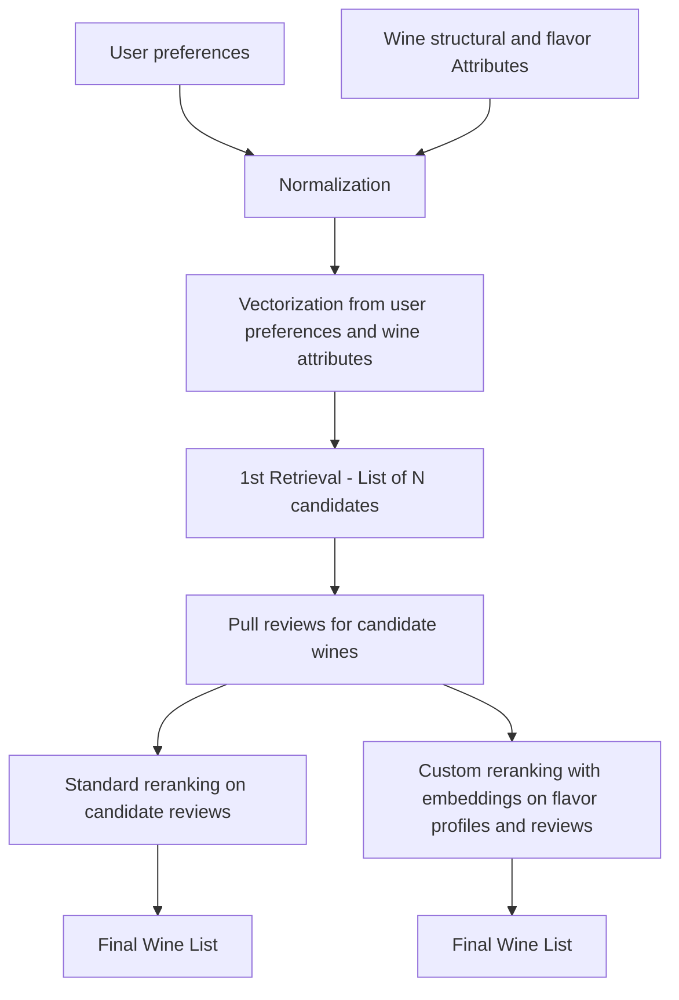
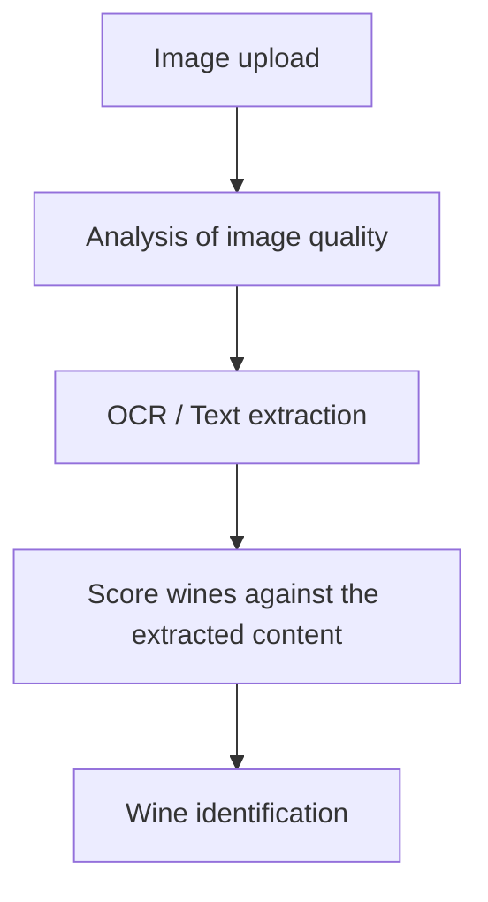

# Build a multimodal wine recommender with OCR

Real product flows often need search and extraction at the same time. A user might know they want "something fruity and not too tannic" or they might just have a photo of a bottle they liked. Most stacks would solve those with two separate services and two separate codebases.

This demo wires both into one app on [SIE](https://superlinked.com/docs/). Type taste preferences and get ranked wine recommendations, or upload a bottle photo and get the wine identified from its label. The recommendation flow uses `encode` and `score`. The label flow uses `extract` for OCR. Both run through one SIE endpoint, behind a single Next.js UI.

It wires together two separate prototype features:

- `wine_flavor/`: wine retrieval and reranking from flavor + structure preferences. This uses both the [encode](https://superlinked.com/docs/encode) and [score](https://superlinked.com/docs/score) primitives of the SIE.
- `wine_picture_detection/`: OCR-based wine label detection, using the [extract](https://superlinked.com/docs/extract) primitive.

Those two pieces are connected through the root `app.py` so you can try them in one UI, but they are also meant to be runnable on their own from inside their own folders. Please refer to the instructions in the README in each sub-folder to do so.

The duplicated database files (`wine_flavor.db`) and local `.env` setup are intentional. The goal is to let someone open either subproject directly and run it in isolation without depending on the full root app setup.

## What You Can Do

- Enter flavor and structure preferences to get wine recommendations
- Compare recommendation behavior across different reranking approaches
- Upload a wine label image and inspect the OCR-driven bottle matching flow
- Use the combined app as a reference for wiring multiple SIE primitives into one user-facing demo

## Project Structure

- `sie/examples/wine-recommender/app.py`: demo backend that wires OCR and retrieval into one FastAPI app
- `sie/examples/wine-recommender/app/`: Next.js frontend for the demo UI
- `sie/examples/wine-recommender/wine_flavor/`: standalone retrieval and reranking prototype
- `sie/examples/wine-recommender/wine_picture_detection/`: standalone OCR and label-matching prototype

## SIE Features Used

- `encode` for retrieval embeddings
- `score` for reranking candidate wines
- `extract` for OCR-based wine label detection

## Why The OCR Flow Matters

The OCR side of the demo shows that SIE is not only useful for text retrieval. In this example, `extract` is used to pull readable text from a bottle label image, then that text is matched against the local wine catalog to identify the bottle.

This is important because real product flows often combine search and extraction rather than using only one primitive. A user may not know the exact wine name, but they may still have a label photo. The OCR path turns that image into usable text and then connects it back to the recommendation and catalog experience.

The OCR pipeline is also intentionally model-flexible. You can use this example to try different OCR-capable extraction models through SIE without rewriting the application flow, which makes it a useful reference for developers who want to evaluate image-to-text approaches quickly.

## Schema Design

### Wine Recommendation



### Wine Identification



## Pre-requisite

In order to run this demo, you will need to start the SIE server. Please refer to the [SIE quickstart page](https://superlinked.com/docs/quickstart) for detailed instructions

The app needs `CLUSTER_URL` so it knows where SIE is running. `API_KEY`
is optional and should stay blank for a local unauthenticated SIE server.

## Running the full Demo

The full app runs through Docker Compose:

- `backend`: FastAPI on `http://localhost:8000`
- `frontend`: Next.js on `http://localhost:3000`

From the repo root:

```bash
cd examples/wine-recommender
cp .env.example .env
# If SIE is not running on your host at port 8080, edit CLUSTER_URL in .env.
docker compose up --build
```

Make sure ports `3000` and `8000` are free before starting the stack.

App URLs:

- Frontend: `http://localhost:3000`
- Backend: `http://localhost:8000`

Stop it with:

```bash
docker compose down
```

## Environment Files

- The root app and `wine_flavor/` subproject use the root `.env`
- `wine_picture_detection/` can also use its own local `.env` / `.env.example`
- The duplicated setup is intentional so both subprojects can be run individually

If you are running the full demo, put the required backend keys in the root `.env`.
For local/self-hosted SIE without auth, leave `API_KEY=` blank.

## What To Try

1. Start the full app and open `http://localhost:3000`.
2. Try recommendation queries with different structure preferences such as:
   `high acidity + low sweetness`
   `full-bodied + high tannin`
3. Upload the sample wine label or your own label image and inspect the detected wine match.
4. Compare how the recommendation and OCR flows use different SIE primitives inside the same app.
5. Pay attention to the OCR output quality and matching behavior. The image path is useful for understanding how extraction can support search and retrieval when the user starts from a photo instead of structured text.

## Notes

- This repo is optimized for demoing the product idea, not for production deployment or large-scale operation.
- The main app is intentionally simple: `app.py` wires together the OCR module and the retrieval module rather than hiding them behind a larger service architecture.
