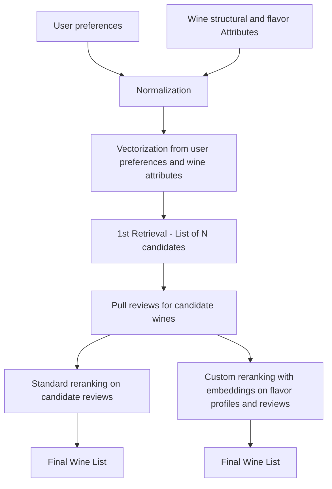
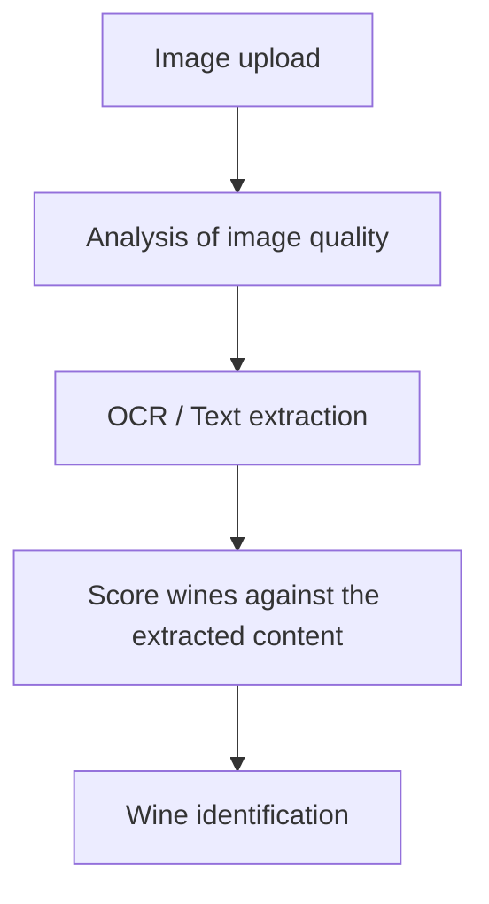

# WineRetrieval

WineRetrieval is a runnable demo app that shows how to combine retrieval, reranking, and OCR-style extraction with [SIE](https://sie.dev/docs/). You can use it to explore wine recommendations from taste preferences, then switch to label detection from an uploaded bottle image.

It wires together two separate prototype features:

- `wine_flavor/`: wine retrieval and reranking from flavor + structure preferences. This uses both the [encode](https://sie.dev/docs/encode) and [score](https://sie.dev/docs/score) primitives of the SIE.
- `wine_picture_detection/`: OCR-based wine label detection, using the [extract](https://sie.dev/docs/extract) primitive.

Those two pieces are connected through the root `app.py` so you can try them in one UI, but they are also meant to be runnable on their own from inside their own folders. Please refer to the instructions in the README in each sub-folder to do so.

The duplicated database files (`wine_flavor.db`) and local `.env` setup are intentional. The goal is to let someone open either subproject directly and run it in isolation without depending on the full root app setup.

## What You Can Do

- Enter flavor and structure preferences to get wine recommendations
- Compare recommendation behavior across different reranking approaches
- Upload a wine label image and inspect the OCR-driven bottle matching flow
- Use the combined app as a reference for wiring multiple SIE primitives into one user-facing demo

## Project Structure

- `sie/examples/wine-recommender/app.py`: demo backend that wires OCR and retrieval into one FastAPI app
- `sie/examples/wine-recommender/app/`: Next.js frontend for the demo UI
- `sie/examples/wine-recommender/wine_flavor/`: standalone retrieval and reranking prototype
- `sie/examples/wine-recommender/wine_picture_detection/`: standalone OCR and label-matching prototype

## SIE Features Used

- [`encode`](https://sie.dev/docs/encode) for tasting-note and review embeddings in the **custom reranker**
- [`score`](https://sie.dev/docs/score) for cross-encoder reranking of candidate reviews in the **standard reranker**
- [`extract`](https://sie.dev/docs/extract) for OCR-based wine label detection

Retrieval itself (the first stage that narrows 5k+ wines down to a candidate set) runs locally with a TF-IDF cosine over structured flavor and taste attributes, so the first-stage retrieval does not call SIE. SIE engages at the reranking and extraction stages.

## Why The OCR Flow Matters

The OCR side of the demo shows that SIE is not only useful for text retrieval. In this example, `extract` is used to pull readable text from a bottle label image, then that text is matched against the local wine catalog to identify the bottle.

This is important because real product flows often combine search and extraction rather than using only one primitive. A user may not know the exact wine name, but they may still have a label photo. The OCR path turns that image into usable text and then connects it back to the recommendation and catalog experience.

The OCR pipeline is also intentionally model-flexible. You can use this example to try different OCR-capable extraction models through SIE without rewriting the application flow, which makes it a useful reference for developers who want to evaluate image-to-text approaches quickly.

## Schema Design

### Wine Recommendation



### Wine Identification



## Pre-requisites

### Get your SIE credentials

This demo does not bundle an SIE server - you bring your own. You need:

- **`CLUSTER_URL`**: the URL of a running SIE cluster you can reach from the machine that runs the backend container
- **`API_KEY`**: a valid API key for that cluster

You can get these either by:

1. **Self-hosting SIE** - see the [SIE quickstart](https://sie.dev/docs/quickstart) to run an SIE server locally or on your own infrastructure, then use that `CLUSTER_URL` and issue yourself an `API_KEY` from the server config
2. **Using a managed SIE cluster** - grab the `CLUSTER_URL` and `API_KEY` from your SIE dashboard

Background on the SIE primitives this demo uses:

- [`encode`](https://sie.dev/docs/encode) - dense embeddings for tasting notes and reviews (used by the "custom" reranker)
- [`score`](https://sie.dev/docs/score) - cross-encoder reranking (used by the "standard" reranker)
- [`extract`](https://sie.dev/docs/extract) - OCR-style extraction on wine label images

### Optional: OpenAI API key

The `/analyze-flavor-prompt` endpoint turns a natural-language wine description into structure and flavor weights using `gpt-4.1-mini`. This is optional - the rest of the demo works without it. Set `OPENAI_API_KEY` in your `.env` only if you want to use the natural-language prompt feature. Get a key at [platform.openai.com/api-keys](https://platform.openai.com/api-keys).

### Docker and Docker Compose

You need Docker and Docker Compose v2 installed. The backend builds against `python:3.12-slim`, so no local Python setup is required.

## Running the full Demo

The full app runs through Docker Compose:

- `backend`: FastAPI on `http://localhost:8000`
- `frontend`: Next.js on `http://localhost:3000`

From the repo root:

```bash
cd examples/wine-recommender
cp .env.example .env           # edit .env and fill in CLUSTER_URL and API_KEY
docker compose up --build
```

Make sure ports `3000` and `8000` are free before starting the stack.

App URLs:

- Frontend: `http://localhost:3000`
- Backend: `http://localhost:8000`

Stop it with:

```bash
docker compose down
```

## Environment Files

- The root app and `wine_flavor/` subproject use the root `.env` (copy from `.env.example`)
- `wine_picture_detection/` can also use its own local `.env` / `.env.example` when you run that subproject standalone
- The duplicated setup is intentional so both subprojects can be run individually

If you are running the full demo, put the required backend keys in the root `.env`.

## Reranker Modes

The recommendation flow supports two reranking strategies, selected via `RERANK_METHOD` in `.env`:

- **`custom`** (default): calls SIE [`encode`](https://sie.dev/docs/encode) on generated tasting notes and (when available) per-wine reviews, then cosine-scores candidates against the user query embedding. Works out of the box with the bundled SQLite catalog, which has structured taste and flavor attributes but no per-wine reviews.
- **`standard`**: calls SIE [`score`](https://sie.dev/docs/score) to rerank each candidate wine's reviews against structure and flavor prompt terms. This mode only produces meaningful scores when wines have reviews - the bundled catalog ships without reviews, so every wine will get a zero rerank score in `standard` mode. If you want to try `standard` mode, re-run the database ingestion under `wine_flavor/db_creation.py` to fetch reviews from Vivino.

## What To Try

1. Start the full app and open `http://localhost:3000`.
2. Try recommendation queries with different structure preferences such as:
   `high acidity + low sweetness`
   `full-bodied + high tannin`
3. Upload the sample wine label or your own label image and inspect the detected wine match.
4. Compare how the recommendation and OCR flows use different SIE primitives inside the same app.
5. Pay attention to the OCR output quality and matching behavior. The image path is useful for understanding how extraction can support search and retrieval when the user starts from a photo instead of structured text.

## Notes

- This repo is optimized for demoing the product idea, not for production deployment or large-scale operation.
- The main app is intentionally simple: `app.py` wires together the OCR module and the retrieval module rather than hiding them behind a larger service architecture.
