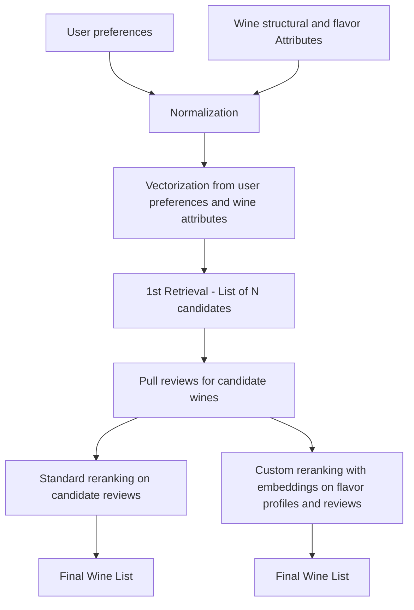

# Wine Flavor

This folder contains the standalone wine retrieval prototype used by the demo app.

It combines:

- Vivino wine metadata and tasting attributes
- in-memory vector retrieval over structure + flavor signals
- SIE-based reranking methods, using both the [encode](https://sie.dev/docs/encode) and [score](https://sie.dev/docs/score) capabilities of the SIE.

This is a good SIE demo because it shows how a stronger model can be added only where it matters most: after fast candidate retrieval, at the ranking stage.

## What It Does

This module starts from structured preferences instead of free-text search.

The retrieval flow:

1. builds vectors from wine structure and flavor data
2. retrieves a candidate set with cosine similarity
3. uses SIE to rerank or embed the candidates for a better final ordering

In the full demo, this logic is wired into the root `app.py`. This folder exists so the retrieval work can also be understood and run as its own prototype.

## Schema Design



## Why SIE Fits This Use Case

SIE is a good fit here because initial retrieval is cheap, but final ranking benefits from stronger semantic understanding.

That makes the split useful:

- local vector search narrows the candidate set fast
- SIE reranking methods improve the final ordering
- the demo can compare a standard reranker against a custom embedding-based approach

This is a good SIE use case because the value is not in replacing the whole system with one model call. The value is in adding a stronger semantic ranking step on top of a simple retrieval pipeline. By allowing the use of multiple models on one GPU, SIE enables the custom semantic layer which tailors the recommended products to the user request.

## Pre-requisite

In order to run this demo, you will need to start the SIE server. Please refer to the [SIE quickstart page](https://sie.dev/docs/quickstart) for detailed instructions

## Setup

From the repo root:

```bash
cd examples/wine-recommender/wine_flavor
```

Create a `.env` file with the required settings:

```env
CLUSTER_URL=https://your-sie-cluster-url
API_KEY=your-sie-api-key
RERANK_METHOD=standard
SIE_RERANK_MODEL=BAAI/bge-reranker-v2-m3
SIE_EMBEDDING_MODEL=BAAI/bge-m3
RERANK_ALPHA=0.7
CUSTOM_RERANK_A=0.75
CUSTOM_RERANK_NO_REVIEW_PENALTY=0.5
DEMO_NUM_PAGES=5
```

`RERANK_METHOD` options:

- `standard`: uses the SIE reranker on candidate review text
- `custom`: uses generated tasting notes, review embeddings, and cosine similarity

`RERANK_ALPHA` mixes the user query embedding with the averaged reference-wine embedding.

`CUSTOM_RERANK_A` mixes review embeddings with generated tasting-note embeddings for each wine.

## Run

This folder is mainly the retrieval prototype code used by the app, so the most direct way to use it is by running the full demo. Detailed instructions to do so are in `sie/examples/wine-recommender/README.md`

If you want to inspect or compare the retrieval logic directly, run the evaluation scripts from the `/sie/examples/wine-recommender` directory:

```bash
python test/eval_queries.py
python test/compare_rerank_methods.py
```

## Retrieval Flow

1. Fetch wines from Vivino or load from the local database
2. Build wine vectors from structure + flavors
3. Retrieve top candidates with cosine similarity
4. Rerank candidates with standard SIE reranking (with the [score](https://sie.dev/docs/score) method) or custom embedding-based reranking (with the [encode](https://sie.dev/docs/encode) method)