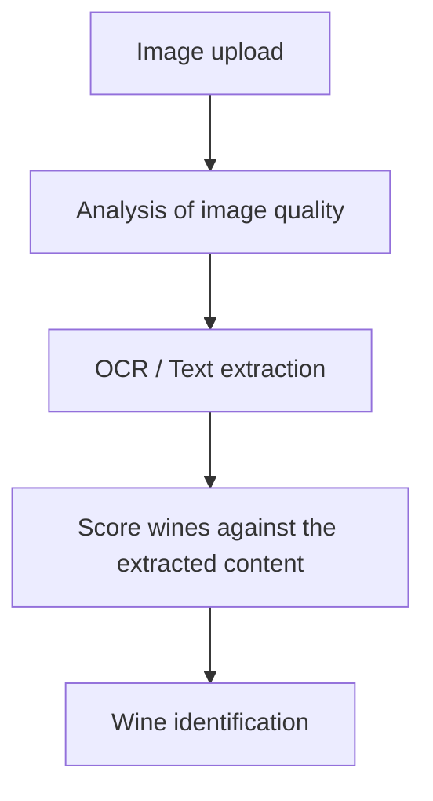

# Wine Picture Detection

This folder contains the standalone OCR-based wine label detection prototype used by the demo app. This leverages the [extract](https://sie.dev/docs/extract) capability of the SIE.

## What It Does

This module takes a wine label image, runs OCR on it, extracts the readable text, and then fuzzy-matches that text against the local wine database to find the most likely bottle.

The main demo app uses this same flow through `wine_picture_detection/service.py`, but this folder is meant to be runnable by itself as a separate project.

## Schema Design



## Why SIE Fits This Use Case

SIE is a good fit here because OCR is the core task and the use of different models allows to refine the content extracted for an improved matching rate.

The hard part is getting usable text out of messy wine-label photos:

- labels have decorative typography
- images can be tilted, noisy, or poorly lit
- the bottle photo often includes partial or imperfect text

Using the SIE lets this prototype focus on extracting structured text accurately from the image first, then doing local matching against the wine database.

## Pre-requisite

In order to run this demo, you will need to start the SIE server. Please refer to the [SIE quickstart page](https://sie.dev/docs/quickstart) for detailed instructions

## Setup

From this folder:

```bash
cd wine_picture_detection
```

Install the Python dependencies you need for this module, then create a local `.env` if you want to run it independently from the repo root.

The OCR flow expects SIE access through environment variables such as:

```env
CLUSTER_URL=https://your-sie-cluster-url
API_KEY=your-sie-api-key
DATABASE_PATH=wine_flavor.db
TOP_N=5
SCORE_THRESHOLD=0
SIE_OCR_MODEL=microsoft/Florence-2-base
OCR_GPU=l4-spot
OCR_PROVISION_TIMEOUT_S=900
```

## Run the OCR script directly

From the repo root:

1. Install requirements

```bash
cd examples/wine-recommender/wine_picture_detection&&pip install -r requirements.txt
```

2. Run the OCR script
```bash
python textract.py
```

You can also pass a specific image and adjust the number of matches returned:

```bash
python textract.py path/to/image.webp --top-n 3
```

`textract.py` will:

- load and preprocess the image
- send it to the configured SIE OCR model
- extract text from the label
- fuzzy-match the text against the local wine database
- print the top match candidates
